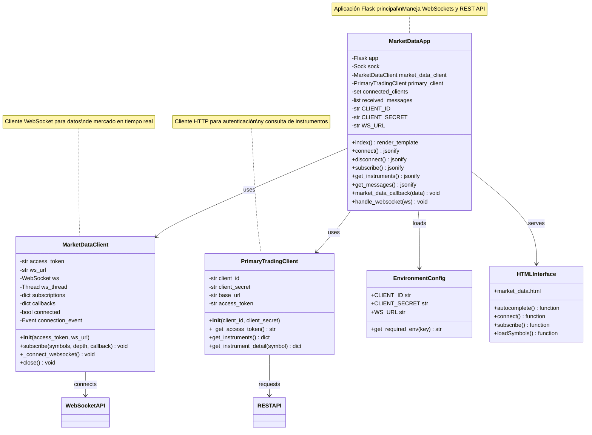
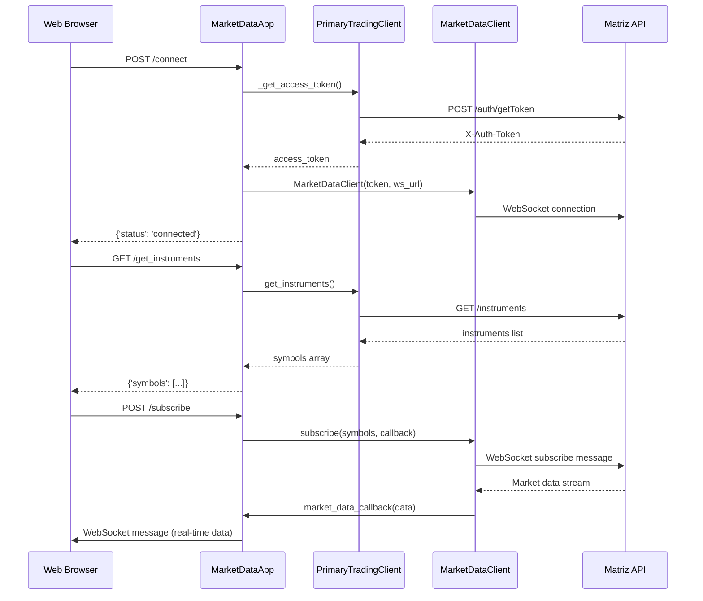

# Diagrama de Clases - API Matriz

## Arquitectura del Sistema

```mermaid
classDiagram
    class MarketDataApp {
        -Flask app
        -Sock sock
        -MarketDataClient market_data_client
        -PrimaryTradingClient primary_client
        -set connected_clients
        -list received_messages
        -str CLIENT_ID
        -str CLIENT_SECRET
        -str WS_URL
        +index() render_template
        +connect() jsonify
        +disconnect() jsonify
        +subscribe() jsonify
        +get_instruments() jsonify
        +get_messages() jsonify
        +market_data_callback(data) void
        +handle_websocket(ws) void
    }

    class MarketDataClient {
        -str access_token
        -str ws_url
        -WebSocket ws
        -Thread ws_thread
        -dict subscriptions
        -dict callbacks
        -bool connected
        -Event connection_event
        +__init__(access_token, ws_url)
        +subscribe(symbols, depth, callback) void
        +_connect_websocket() void
        +close() void
    }

    class PrimaryTradingClient {
        -str client_id
        -str client_secret
        -str base_url
        -str access_token
        +__init__(client_id, client_secret)
        +_get_access_token() str
        +get_instruments() dict
        +get_instrument_detail(symbol) dict
    }

    class EnvironmentConfig {
        +get_required_env(key) str
        +CLIENT_ID str
        +CLIENT_SECRET str
        +WS_URL str
    }

    class HTMLInterface {
        +market_data.html
        +autocomplete() function
        +connect() function
        +subscribe() function
        +loadSymbols() function
    }

    MarketDataApp --> MarketDataClient : uses
    MarketDataApp --> PrimaryTradingClient : uses
    MarketDataApp --> EnvironmentConfig : loads
    MarketDataApp --> HTMLInterface : serves
    MarketDataClient --> WebSocketAPI : connects
    PrimaryTradingClient --> RESTAPI : requests

    note for MarketDataApp "Aplicación Flask principal\nManeja WebSockets y REST API"
    note for MarketDataClient "Cliente WebSocket para datos\nde mercado en tiempo real"
    note for PrimaryTradingClient "Cliente HTTP para autenticación\ny consulta de instrumentos"
```

## Flujo de Comunicación

```mermaid
sequenceDiagram
    participant Browser as Web Browser
    participant App as MarketDataApp
    participant Primary as PrimaryTradingClient
    participant Market as MarketDataClient
    participant API as Matriz API

    Browser->>App: POST /connect
    App->>Primary: _get_access_token()
    Primary->>API: POST /auth/getToken
    API-->>Primary: X-Auth-Token
    Primary-->>App: access_token
    App->>Market: MarketDataClient(token, ws_url)
    Market->>API: WebSocket connection
    App-->>Browser: {'status': 'connected'}

    Browser->>App: GET /get_instruments
    App->>Primary: get_instruments()
    Primary->>API: GET /instruments
    API-->>Primary: instruments list
    Primary-->>App: symbols array
    App-->>Browser: {'symbols': [...]}

    Browser->>App: POST /subscribe
    App->>Market: subscribe(symbols, callback)
    Market->>API: WebSocket subscribe message
    API-->>Market: Market data stream
    Market->>App: market_data_callback(data)
    App->>Browser: WebSocket message (real-time data)
```